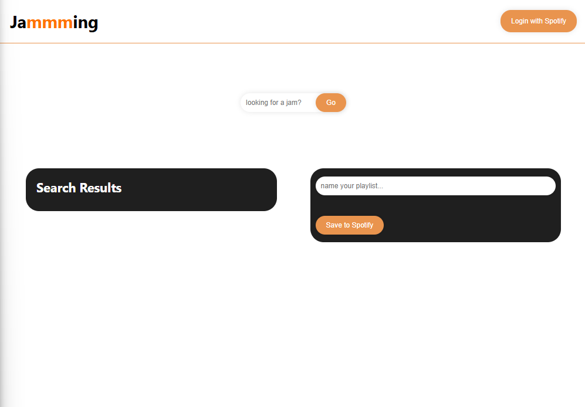
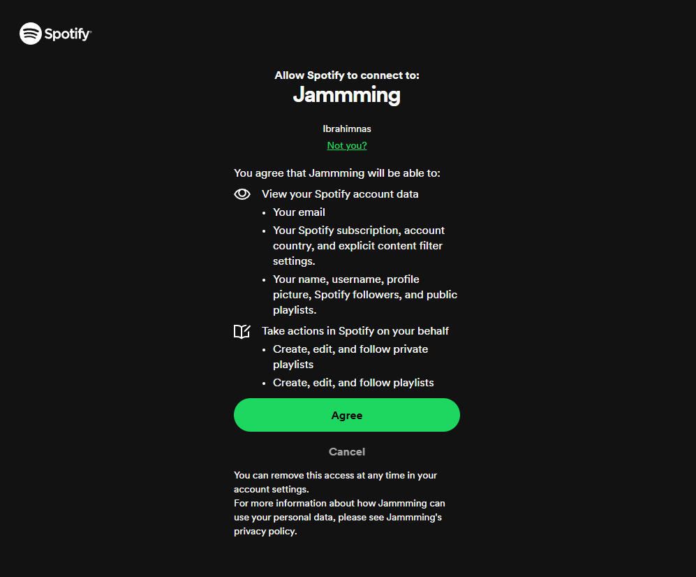
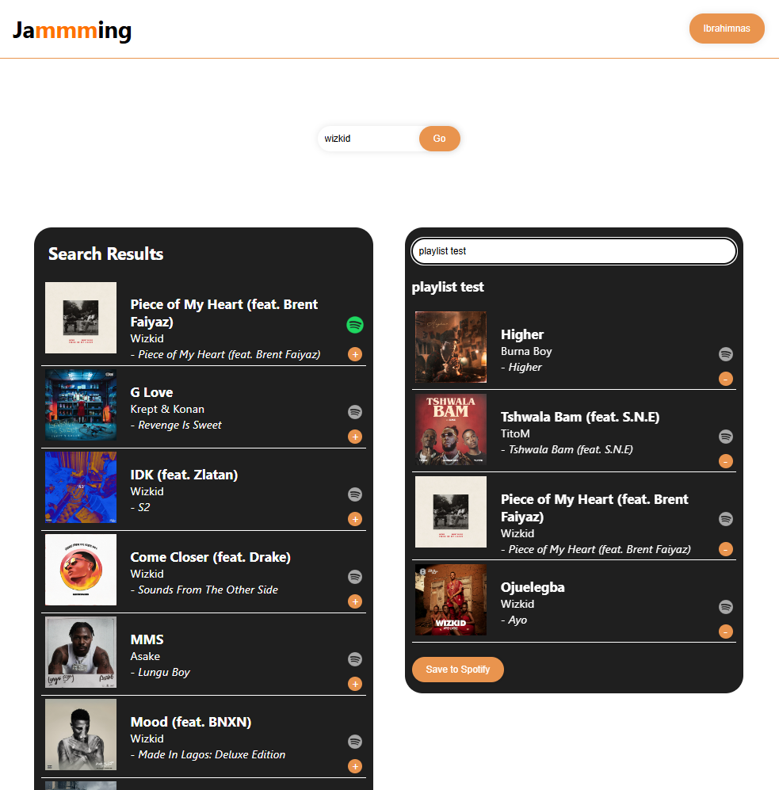

# Jammming Web App

**Jammming** is a web application that integrates with the Spotify API, allowing users to search for their favorite tracks, create custom playlists, and save them directly to their Spotify account. The app uses OAuth to securely authenticate users with Spotify and provides an intuitive interface for interacting with their music.

## Features

- **Search for Songs:**  
  Users can search for songs by name, artist, or album using Spotify’s vast music library.
  
- **Create Custom Playlists:**  
  Users can build playlists by adding tracks from the search results.

- **Save Playlists to Spotify:**  
  Once a playlist is created, users can save it directly to their Spotify account.

- **OAuth Authentication:**  
  Secure user login via Spotify’s OAuth, ensuring user privacy and secure access to Spotify data.

## Screenshots

### landing page


### OAuth via Spotify


### Functioning Jammming App



## Technologies Used

- **Frontend:**
  - JavaScript (React)
  - HTML, CSS
  - Spotify Web API

- **Backend:**
  - No backend required, interacts directly with the Spotify API

- **Authentication:**
  - OAuth 2.0 via Spotify

## Getting Started

### Prerequisites

- You will need a [Spotify Developer account](https://developer.spotify.com/) to use the Spotify API.
- Create a Spotify app and obtain your **Client ID** and **Client Secret**.

### Installation

1. Clone this repository:
   ```bash
   git clone https://github.com/EbrahimNDev/jammming-web-app.git
   cd jammming-web-app

2. Install dependencies:
   ```bash
   npm install

3. Set up environment variables:
   - Create a .env file in the root directory and add your Spotify credentials:
     ```bash
     REACT_APP_SPOTIFY_CLIENT_ID=your_spotify_client_id
     REACT_APP_SPOTIFY_REDIRECT_URI=your_redirect_uri

4. Start the development server:
   ```bash
   npm start
